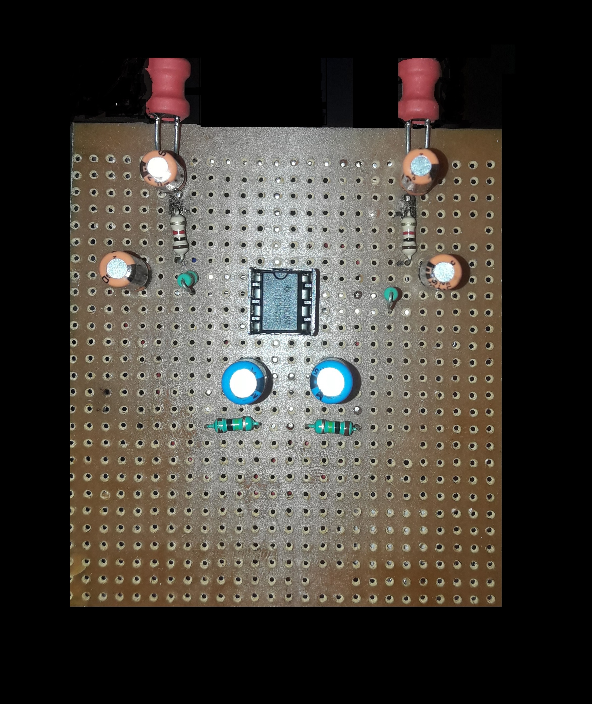
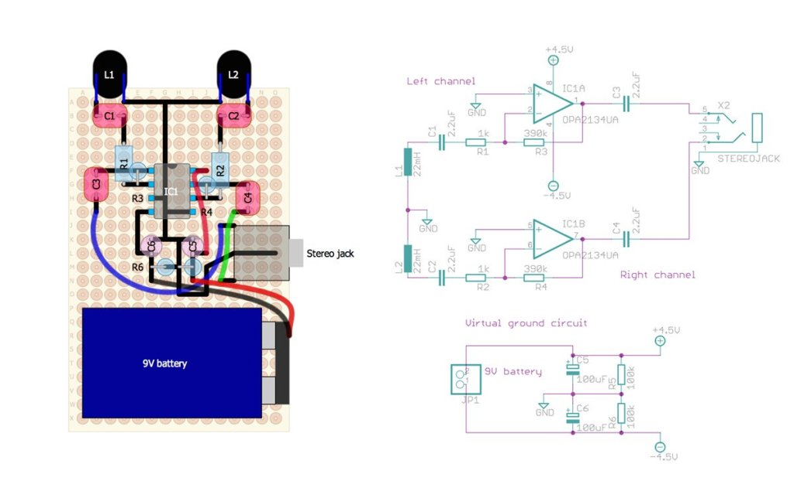

# Elektrosluch

A device to convert electromagnetic waves from electronic/electrical devices to sound. It is a clone of an open-source device.  
The objective of this project is to create a device capable of sensing electromagnetic waves, interpret it and give output as sound wave. This device is called ELEKTROSLUCH.
When the circuit is put near a sources of constant potential difference like laptop and mobile phone it produced sound. The signals were transferred to the source and vice versa
through radio waves and could easily be demodulated to sound waves. Extracting the original information-bearing signal from a carrier wave is called demodulation.
A demodulator is an electronic circuit that is used to recover the information content from the modulated carrier wave.
A number of observations were taken and recorded for future reference.      
We can add a volume control scroll to increase or decrease the volume by connecting a dual logarithmic potentiometer before the stereo jack. 
We can use more sensitive inductors and better operational amplifier, better opamps will improve the signal to noise ratio.
Moreover, get an update for different components if available. 
We can cover it with a plastic body to give it protection and make it better looking and handy.

    

    

# Files
Audio Samples - Audio files recorded near electronic/electrical devices  
Images - Device and design images  

# Warning
The audio files contain loud and high-pitched noise, please keep the volume low.  

# Acknowledgment
[LOM - For creating the open-source device Elektrosluch](https://store.lom.audio/products/elektrosluch-3?variant=4542168268832)  
[Make: Community - For providing the idea and design](https://github.com/samuelcust/flappy-bird-assets )
